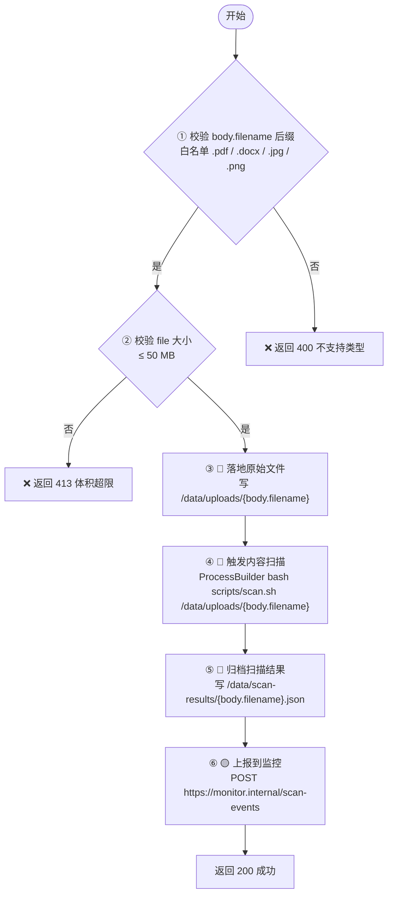

<!--
单条目产物（surface-iface-*.md / surface-noniface-*.md）的格式参考。可被被分析项目内的同名文件覆盖。

每个 subagent 撰写自身的产物时，将下文 `#### {METHOD} {URL}` 一节的
标题升级为顶层 `# {METHOD} {URL} — 一句话功能`，正文格式照搬。本文件的顶层
"业务流讲解" / "整体在做什么" / "子功能 N" 等结构面向 aggregator（overview.md /
features.md）使用——单接口产物文件不包含此类外层包装。

约定：图自包含——优先把输入流向、关键控制点、硬编码标注等事实**嵌入节点标签**；
图能承载的下方文字 labeled 列表不再重复，仅保留图无法承载的（如 DTO 全限定名 /
请求体字段树）。入口节点统一用 `START([开始])`，接口 URL / 请求维度由标题与
`**请求**` 行承载。

文件 I/O / 命令 / 外呼 / SQL 节点**必须**写出目标本身（文件系统路径 / 完整命令行 /
URL with method / 表名），禁止只写"执行脚本 / 调网关 / 写入文件 / 上报监控"等抽象表述；
动态片段用 `{变量名}` 标注并指明来源。详见 SKILL.md「文件操作目标路径必报」条款。

长路径 / URL / 命令一律写全——放不下用 ` ` 换行而非 `...` 截断；详见
SKILL.md「代码引用 / 路径 / URL / 命令一律原样保留」条款。

路径 / 命令中变量值能沿数据流回溯到常量（`static final` / 字面量赋值 / 工作区配置
字面量 / `@Value` 字面默认值 / 枚举字面量等）的，**必须代入字面量**并写出拼接后的
最终字符串；`{var}` 占位**仅**保留给运行时动态输入；详见 SKILL.md「路径 / 命令 / URL
中的变量值要做常量传播」条款。

下例 ③④⑤ 为用户输入拼接到文件路径/命令，属于高观测优先级（`🔴`）；
⑥ 为硬编码 URL + TLS 关闭，存在风险但无用户输入，属于低观测优先级（`🟡`）。
图节点用 `{...}` 菱形表示判断分支，`[...]` 矩形表示处理步骤，`([...])` 圆角表示起点。
-->

# {范围名} 业务流讲解

## 整体在做什么

80-200 字段落形式叙述：本范围内代码的功能、触发者、关键流程的串接关系。

## 业务流

### 子功能 1：文件管理

#### POST /api/files/upload

用户向系统提交一份业务文件（合同、表单、附件等）进行存档（com.acme.file.UploadController#upload，UploadController.java:48）。处理流程分为**前置校验 → 核心处理 → 异常终止**三组：先校验文件后缀与大小，通过后落地原始文件、触发扫描、归档结果、上报监控；任一校验失败直接返回 4xx。

## 未能追溯的引用

仅在存在未能定位的下游目标时撰写本节，按 `<引用> — 调用点 (文件:行号)` 一条一行；无则**略去整节**。硬编码绝对路径走 SKILL.md「硬编码绝对路径不出工作区访问」条款的后缀匹配——未命中按下示第二行格式记录"已尝试的后缀候选"。

- `scripts/scan.sh` — 调用点 com.acme.file.UploadController#upload（UploadController.java:71），未在工作区找到该脚本
- `/opt/myapp/scripts/scan.sh`（硬编码绝对路径） — 调用点 com.acme.file.UploadController#upload（UploadController.java:71），尝试后缀匹配工作区未命中 `myapp/scripts/scan.sh` / `scripts/scan.sh` / `scan.sh`
