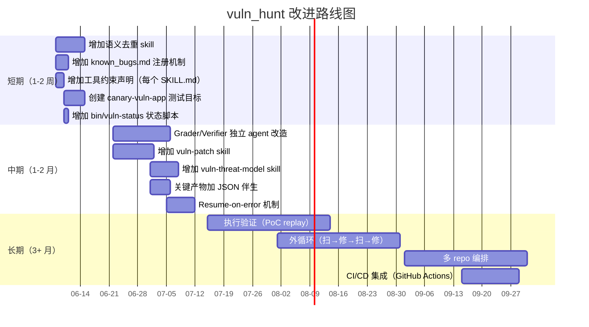

# 项目洞察分析报告

> **参照对象**：anthropics/defending-code-reference-harness (5.1k ⭐, 332 🍴)
> **分析对象**：vuln_hunt（当前项目）
> **日期**：2026-06-08
> **目的**：通过对比找差距，列出可落地的改进项与路线图

---

## 一、两个项目定位对照

| 维度 | 参考项目 | vuln_hunt |
|---|---|---|
| **核心目标** | 自主发现并修复 C/C++ 内存漏洞 | 通过 LLM skill 流水线做 source/sink 双向漏洞分析 |
| **目标语言** | C/C++（使用 ASAN 验证） | 语言无关（REST/MQ/gRPC/Java/Go/Python 等） |
| **执行范式** | 动态执行验证（ASAN 崩溃 + 3/3 重现 + PoC 字节） | 静态分析（LLM 阅读源码 + 调用链追踪 + 推理） |
| **流水线形态** | recon → find → verify → dedupe → report → patch（6 阶段） | source: collect→analyze→analyze-vuln→review（4 阶段）<br>sink: collect→analyze-vuln→review（3 阶段） |
| **交付物** | report.json + patch.diff + 验证证据（PoC 字节） | VULN-/DISMISSED-/CLEAN-/SUSPECTED-*.md markdown |
| **安全沙箱** | gVisor 容器 + 网络出口白名单（api.anthropic.com:443） | 未实现（依赖 Claude Code 的用户授权） |
| **可移植性** | /customize skill 引导移植到任意目标栈 | skill 自身按"暴露面分类"抽象，与语言解耦 |
| **去重机制** | 运行时 `<dup_check>` + judge agent 语义去重 | 无 |
| **模版认证** | 4 档 grader（T0 编译/T1 PoC 失效/T2 测试通过/T3 re-attack） | 无 |
| **成熟度** | 20+ 人年经验（来自 Glasswing 合作），生产化 | 早期阶段，11 个 skill，实验性 |

---

## 二、当前项目已经做对的事

### 优势 1：Source/Sink 双向流水线是差异化竞争力

参考项目主要做 fuzzing（source 到 crash）。vuln_hunt 把 sink 作为独立一等公民——反向数据流追踪是 vuln_hunt 独有的，参考项目没有对位 capability。这是未来可以宣传的差异化卖点。

### 优势 2：Pipeline 编排器

source-orchestrator / sink-orchestrator 与参考项目的 vuln-pipeline run 思路一致。vuln_hunt 用 skill-to-skill 调度（task subagent 嵌入每条目 5 并发），参考项目用 Python `harness/` 做编排。没有本质优劣，skill 方式的优势是零代码、纯 prompt。

### 优势 3：产物目录结构统一

`.vuln_agent_output/` 与参考项目的 `results/<target>/<ts>/` 等价。`.surface_discover_done` 完成信号类似 `result.json` checkpoint。文件名带 MMDD-HHMMSS 时间戳比参考项目更紧凑（参考项目用目录分层，vuln_hunt 用文件名编码）。

### 优势 4：认定分级比参考项目更精细

| 参考项目 | vuln_hunt |
|---|---|
| 只区分 "passed / failed + severity" | VULN / DISMISSED / CLEAN / SUSPECTED（4 档） |
| 无 SUSPECTED | SUSPECTED 是审计友好设计——"信息不足不降级" |
| 没有 "已确认防护" 标签 | DISMISSED 明确表示"有防护" |

SUSPECTED 和 DISMISSED 是 vuln_hunt 相对于参考项目最重要的设计创新。

### 优势 5：三种工作模式灵活

vuln_hunt 的"默认模式（读已有产物） / 优化模式（改已有产物） / 直接分析模式（用户直接描述）"在参考项目中不存在。这种交互灵活性更适合非流水线（交互式）使用场景。

---

## 三、关键差距（按优先级排序）

### P0：核心架构差距

---

#### 差距 1：缺少独立的 Grader / Verifier 角色

**参考项目的做法**：

```yaml
# 参考项目的核心信任边界
find agent: 读源码 → 构造输入 → 跑 ASAN → 提交 PoC
    |                               ↑
    |  只传 PoC 字节（不传推理过程）    |
    ↓                               |
grade agent: 新容器接收 PoC → 独立复现 → 输出 verdict
judge agent: 对比 manifest → NEW / DUP_BETTER / DUP_SKIP
```

- find agent 和 grade agent 在**不同容器**中
- 两者之间**只通过 PoC 字节**通信
- grader 被要求"guilty until proven innocent"——必须 3/3 复现才算确认
- 参考项目的博客原文："The grader must run as a separate agent with access to a clean sandbox in which it can run any proofs of concept. It should be framed as an adversary actively trying to disprove findings."

**当前项目的做法**：

```
source-analyze-vuln: 自产自评（同一 LLM 进程内）
source-review:      同一 LLM 进程内复核
```

**改进方案**：

1. 在 `source-analyze-vuln` 中把 "分析" 和 "验证" 拆成两个阶段：
   - 分析阶段：LLM 阅读源码 → 输出 VULN-*.md 初版（含证据、调用链）
   - 验证阶段：**新 LLM 进程**接收初版文件（不附带分析阶段对话）→ 复现证据 → 输出 VULN-*.md 终版

2. 在 `source-review`（和 sink-review）的 prompt 中显式加上：
   ```
   ###############################################
   # 约束：你是独立的 Verifier
   # - 你不应该看到第一轮分析的推理过程
   # - 你只应该看到最终的结论和证据
   # - 你必须以"有罪推定"的姿态审查
   ###############################################
   ```

3. 如果 subagent 机制允许，验证阶段使用**不同 model**（cheaper model vs deeper model）。可以参考参考项目的 "judge agent 无工具、纯 prompt 调用"。

---

#### 差距 2：缺少语义去重机制

**参考项目的做法**：

两层去重：

```
Layer 1: 运行时去重（find agent 提交时）
  - agent 必须输出 <dup_check> 标签 + 推理
  - 对比 found_bugs.jsonl（语义对比，不是字符串匹配）

Layer 2: 报告门去重（judge agent）
  - 每条通过 grade 的 crash 对比 manifest
  - NEW / DUP_BETTER（替换） / DUP_SKIP
  - 同一根因、不同 ASAN 帧也能去重
```

**当前项目的做法**：

- 文件名有时间戳，物理上不覆盖
- 但同一个根因可能在多轮扫描中产生多个 `VULN-{stem}-1.md` / `VULN-{stem}-2.md`
- 没有机制判断"这个 VULN 和上次那个是不是同一个 bug"

**改进方案**：

增加 `vuln-dedupe` skill：

```markdown
---
name: vuln-dedupe
---

# vuln-dedupe

读 `vuln_findings/` 下的所有 VULN-*.md 文件，做语义去重。

## 去重逻辑

对每对 VULN 文件：
1. 提取 `**位置**`（文件:行号）
2. 提取 `**类型**`（漏洞分类）
3. 提取 `**调用链**`（入口 → 敏感操作）
4. 语义判断："是否同一根因"
   - 同一文件 + 相邻行号 + 同一漏洞类型 ⇒ 去重（保留最完整的）
   - 不同文件 + 相同调用链 + 同一入口 ⇒ 合并报告

## 输出

- `deduped_vuln_findings/VULN-{stem}.md`：去重后的结论
- `deduped_vuln_findings/_duplicates.md`：被合并的文件列表
- 保留原文件不动（不改 vuln_findings/）
```

在 orchestrator 中加 Stage 4（去重阶段）：

```
[4] vuln-dedupe
    → deduped_vuln_findings/
```

---

#### 差距 3：缺少 Patch 生成 + 验证

**参考项目的做法**：

`vuln-pipeline patch <results_dir>` 自动走 4 阶验证：

```
T0: apply diff → rebuild（编译通过）
T1: 原 PoC 不再触发 crash
T2: target 测试套件通过
T3: 新 find agent 攻击 50 轮，确认无法绕过
```

每阶失败喂回 patch agent 迭代（≤5 轮）。输出：`reports/bug_NN/{patch.diff, patch_result.json}`。

**改进方案**：

增加 `source-patch` / `sink-patch` skill：

```markdown
---
name: source-patch
---
# source-patch

输入：`deduped_vuln_findings/VULN-{stem}.md`
输出：`patches/VULN-{stem}.diff` + `patches/VULN-{stem}-verification.md`

## 验证阶梯

T0: 读源码确认修复点 → 输出 diff（git format-patch 风格）
T1: （可选）如果目标是可构建项目 → 尝试 apply + 编译
T2: 没有 PoC 环境 → 至少做*逻辑验证*（LLM 重新阅读 patched 代码确认修复逻辑闭环）
```

考虑添加 `references/patch-rules/` 目录，存放常见修复模板（SQL 参数化、路径规范化等）。

---

#### 差距 4：缺少执行验证

**参考项目的做法**：

"运行型"漏洞发现：
- ASAN 崩溃 = 强证据
- 3/3 重现 = 验证
- PoC 字节 = 可传递的交付物

**当前项目的做法**：

"阅读型"漏洞发现（纯静态分析）：
- 证据 = LLM 贴的代码片段
- 结论 = LLM 推理
- 交付物 = markdown

**差距的本质**：

这不是一个纯实现 gap，而是一个**产品定位选择**。vuln_hunt 选择了"语言无关的静态分析"，参考项目选择了"特定语言（C/C++）的动态验证"。

**改进方案**（中长期）：

分语言支持 PoC 验证：

```yaml
languages:
  python:
    verify_command: python3 -c "{poc}"
    sandbox: docker / venv
  java:
    verify_command: mvn test -Dtest={test_class}
    sandbox: docker
  javascript:
    verify_command: node {poc_script}
    sandbox: docker
```

这需要较大的工程投入。替代方案：在 `source-analyze-vuln` / `source-review` 的 prompt 中增加 "**可验证性评分**" 字段——让 LLM 自行评估"这个发现的证据可以 123 步复现 vs 纯推理结论"。

---

### P1：流程机制差距

---

#### 差距 5：缺少 Recon / Focus Area 分流

**参考项目的做法**：

```
recon: 读源码 → 提出 N 个 focus area
  → N 个 find agent 分别攻击不同 area
  → 避免收敛到同一个 bug
```

在 `config.yaml` 中也可手写 `focus_areas:` 跳过 recon。

**改进方案**：

在 `source-collect`（或 collect 之后、analyze 之前）增加 `source-recon` stage：

```yaml
1. source-collect  → discovered_surfaces/*.md（当前做法）
2. source-recon    → .vuln_agent_output/focus_areas.yaml（新增）
   - 基于 discovered_surfaces/ 按调用深度、业务关键度打分
   - 产出优先级排序列表
3. source-analyze  → 按 focus_areas 优先级调度并发（高分先派）
```

如果不想新增 skill，也可以在 `source-orchestrator` 中的 Stage 1 之前加一个 prompt-only recon 步骤：

```
步骤 1.a（新增）：在开始分析前，先快速浏览所有 surface 文件
    → 输出 priority queue（高/中/低三档）
    → 只有高档位触发 Stage 1 并发
```

---

#### 差距 6：缺少 Threat Model 前置

**参考项目的做法**：

`/threat-model bootstrap <target>` → 产出 `THREAT_MODEL.md`：
- 项目结构总览
- 关键子系统
- 风险分布
- 优先级建议

后续的扫描和 triage 都基于 threat model **缩范围**和**校准严重性**。

**改进方案**：

增加 `source-threat-model` skill：

```markdown
---
name: source-threat-model
---

# source-threat-model

输入：目标目录（被扫描项目）
输出：.vuln_agent_output/THREAT_MODEL.md

## 威胁模型内容

- 项目主架构描述
- 关键组件列表（含风险理由）
- 外部暴露点总览（API 入口 / 认证边界 / 数据流接口）
- 高置信度风险预判
- 推荐扫面优先级

## 原则

- 只基于目录结构和已知文件名做判断（不深入读源码）
- 产出是"定向仪"，不是"证据"
- 后续 source-collect / source-analyze 可以基于此缩范围
```

---

#### 差距 7：缺少跨次扫描去重（known_bugs）

**参考项目的做法**：

`/triage results/<target>/ --auto --votes 5`：
- 聚合多次 run 的 findings
- 与已知结果对比去重
- 新版本可排除已知结果

**改进方案**：

在 `.vuln_agent_output/` 下维护 `known_bugs.md`：

```markdown
# Known Bugs Register

## Bug-001（2026-06-07 确认）
- CWE：CWE-89（SQL 注入）
- 位置：src/main/java/com/acme/UserDao.java:48
- 状态：已修 / 待修
- 特征：参数 id 直接拼接 SQL

## Bug-002（2026-06-08 确认）
- CWE：CWE-22（路径穿越）
- 位置：src/main/java/com/acme/FileController.java:72
- 状态：待修
- 特征：filename 参数未做 ../ 校验
```

每次 `source-analyze-vuln` / `sink-analyze-vuln` 前置检查：

```
分析前检查 known_bugs.md
  → 如果当前 surface 与已知 bug 匹配
    → 跳过分析，引用已知记录
  → 如果 surface 是已知 bug 的变体
    → 仅分析差异部分
```

这能显著减少重复劳动（而且随时间积累越来越有用）。

---

#### 差距 8：缺少 Novelty Check（上游是否已修复）

**参考项目的做法**：

```
--novelty 标志（默认 off）：
  shallow-clone 目标远程 git 仓库
  git log <commit>..HEAD -- <crash_file>
  → 报告注入 FIXED / UNFIXED 字段
```

**改进方案**：

在 `source-review` / `sink-review` 的「审查方法」中增加一条（非必须、当目标有 git remote 时执行）：

```markdown
## 上游状态检查

如果目标项目有 `git remote`：
1. 检查最近 log 是否涉及当前漏洞文件的修改
2. 查看最近的 commit message 是否提及修复
3. 输出 `**上游状态**：已修复 / 未修复 / 不确定`

不使用 --novelty 这种复杂机制——简单的一行 git log 就够了。
```

在 `source-orchestrator` 和 `sink-orchestrator` 中可以不默认开启，改由用户消息触发。

---

### P2：工程化差距

---

#### 差距 9：缺少沙箱与工具约束

**参考项目的做法**：

```
agent 工具集固定：
  find/grade/report: Read / Write / Bash（strict，没有 MCP / web access）
  judge/compare:     no tools（纯 prompt）
网络：
  容器内 egress 只允许 api.anthropic.com:443
权限：
  CLAUDECODE= 去嵌套会话检查
  IS_SANDBOX=1 允许 bypassPermissions
  --permission-mode bypassPermissions
```

**当前项目的做法**：

每个 skill 的 SKILL.md 声明了"做什么"但没有声明"用什么工具可以做"。之前已经通过 vuln-dispatch 的重写部分解决了"不读项目代码"的问题，但这是**约定层**的（LLM 自觉遵守），不是**执行层**的约束。

**改进方案**：

在每个 SKILL.md 的 frontmatter 中增加工具声明（如果 LLM 环境支持）：

```yaml
---
name: source-analyze
allowed_tools:
  - Read    # 只读特定目录
  - Bash    # 只运行 git log / grep 等
forbidden_tools:
  - Write   # 除 .vuln_agent_output/ 外禁止写
  - Edit    # 不修改源文件
---
```

对于 source-collect 这类需要写文件的 skill，可以在 bash 命令前加 target validation：

```yaml
allowed_write_paths:
  - .vuln_agent_output/**
forbidden_write_paths:
  - ./**
  - /*/**
```

如果 LLM 环境不支持工具级 ACL，至少要在每个 SKILL.md 开头加一个显式声明：

> ## 工具使用约束
> 
> `Read` 只允许读 `.vuln_agent_output/` 和被分析项目的 `src/`、`config/`、`lib/`、`api/` 等常规代码目录。
> `Bash` 只允许运行 `git`、`grep`、`find` 等只读命令，禁止 `rm`、`mv`、`chmod` 等写操作。
> `Write` 只允许写到 `.vuln_agent_output/` 下。

---

#### 差距 10：缺少结构化产物格式

**参考项目的做法**：

```
report.json：
  {
    "bug_id": "BUG-001",
    "cwe_id": "CWE-22",
    "severity": "high",
    "cvss": 7.5,
    "primitive": "arbitrary-read",
    "reachability": "network-remote",
    "escalation": "read-passwd → information-disclosure"
  }

found_bugs.jsonl（流式追加，每行一个 JSON 对象）
result.json（每个 run 的 verdict）
patch_result.json（T0/T1/T2/T3 状态）
```

**当前项目的做法**：

全部 markdown。跨 skill 解析产物靠"读 markdown 文本 → 按标题名 parse"。

**改进方案**：

关键产物增加 JSON 伴生文件：

```yaml
# 当前                   → 新增
vuln_findings/             vuln_findings/
  VULN-{stem}-{n}.md          VULN-{stem}-{n}.md
                               VULN-{stem}-{n}.json  ← 结构化元数据

.json 格式建议：
{
  "type": "VULN",
  "cwe_id": "CWE-89",
  "severity": "critical",
  "cvss": 9.8,
  "location": "src/main/java/com/acme/UserDao.java:48",
  "call_chain": ["UserController.listUsers", "UserService.findAll", "UserDao.findByQuery"],
  "source": "iface-REST-user-list-0608-021435.md",
  "timestamp": "2026-06-08T02:14:35Z"
}
```

好处：
- 跨 skill 解析更快（JSON 比 markdown 更易 parse）
- 可以批量排序（按 severity 排、按位置排）
- 未来可以做 dashboard

---

#### 差距 11：缺少 Resume-on-Error

**参考项目的做法**：

```yaml
# 429 / 5xx 处理
回到LLM CLI：内部重试
LLM CLI 放弃后：pipeline 自己的退避（exp + cap 300s）
退避后：--resume <session_id> 恢复完整对话上下文
最大 20 次重试

# Transcript 落盘
find_transcript.jsonl（流式追加，每行 fsync 落盘）
grade_transcript.jsonl
recon_transcript.jsonl
report_transcript.jsonl + _grader.jsonl
```

中间 kill 不会丢工作——磁盘上有完整 transcript，可以 `--resume`。

**改进方案**：

1. 短期（本周可做）：在 `source-orchestrator` / `sink-orchestrator` 的失败处理中增加 `meta/error/{stage}.md` 记录失败详情：

```yaml
# 当前
- 子 skill 失败 → 跳过该项，继续跑其他项，最终报告里列出失败项

# 改进
- 子 skill 失败 → 把失败 subagent 的 task_id 写入 meta/error/{stage}.md
  → 允许用户在失败修复后重跑（不重复已完成的）
  → 最终报告列出失败项时附带 task_id
```

2. 中期（1-2 周）：在每个 skill 的阶段产物目录加 `.task_progress` 文件：

```yaml
.vuln_agent_output/
  discovered_surfaces/
    .task_progress.jsonl  ← 流式追加：每个 source-analyze 完成后记录
    iface-REST-*.md
```

这样重跑时可以先读 `.task_progress.jsonl` 跳过已完成的条目。

3. 长期：如果 subagent 支持 `--resume`，在 orchestrator 的失败处理中增加 resume 逻辑。

---

#### 差距 12：缺少 Subagent Model 锁定

**参考项目的做法**：

```shell
export CLAUDE_CODE_SUBAGENT_MODEL=<model-id>
# 所有 subagent 使用同一模型

# 或 per-stage 指定
vuln-pipeline run <target> --model <model-id>
vuln-pipeline patch <target> --model <model-id>
```

"Model is a runtime arg, not config."

**改进方案**：

在 README 中增加：

```markdown
## 模型管理

当前项目的 subagent 使用 LLM 客户端默认模型（Claude Code 通常默认 Claude 4）。

推荐做法：
- 在运行 orchestrator 之前设置环境变量锁定 subagent 模型：
  ```shell
  export CLAUDE_CODE_SUBAGENT_MODEL=claude-sonnet-4-20250514
  ```
- source-collect / sink-collect 可以用较轻量模型
- source-analyze-vuln / source-review 建议用更深的模型

未来规划：在 orchestrator 的 SKILL.md 中显式声明每个 stage 的推荐模型。
```

---

### P3：体验与质量差距

---

#### 差距 13：缺少测试覆盖

**参考项目的做法**：

```
pytest tests/：
单元测试覆盖：
  - tag/XML 解析
  - artifact 序列化/反序列化
  - ASAN 签名提取
  - focus area 渲染
  - dedup 签名
  - found_bugs.jsonl 处理
  - judge/compare agent
  - 报告解析
  - T0-T3 patch 阶梯验证
  - /threat-model skill checkpoint
  - /triage skill checkpoint
  - system-prompt 构造
```

**改进方案**：

在 `tests/` 目录中增加至少以下测试（不需要 pytest，用 shell + git diff 也可以）：

```yaml
tests/
  fixtures/
    canary-vuln-app/         ← 故意有已知漏洞的小项目（Java / Python）
      src/main/java/com/...
      pom.xml
      README.md
    canary-discovered/       ← 预生成的 collected surfaces
      iface-REST-*.md
    canary-analyzed/         ← 预生成的 analyzed surfaces
      iface-REST-*.md

  smoke-test.sh              ← 冒烟测试：跑 canary、检查预期产物
  naming-consistency-test.sh ← 验证所有 SKILL.md 的 frontmatter name 与目录名一致
  self-check-test.sh         ← 对每个 SKILL.md，构造 input fixture 后跑自检
```

冒烟测试什么可以不做：
- 不造产物的"正确性"验证（那是 LLM 的工作）
- 只验证**产物格式**（文件名 schema 一致、必填字段存在、没有意外文件）

---

#### 差距 14：缺少 Canary / Fixture 目标

**参考项目的做法**：

```
targets/
  canary/         ← 6 分钟、3 个 planted bug、快速烟雾测试
  drlibs/         ← 真实 CVE 目标（pinned vulnerable commit）
  alsa/           ← 真实 CVE 目标
  htslib/         ← 最难目标（10-CVE cluster）
```

canary 的目标：
- 第一次跑的用户能快速看到结果，建立信心
- 改 prompt 后快速验证效果
- 可以 CI 集成

**改进方案**：

创建 `tests/fixtures/canary-vuln-app/`（一个小型 Java Spring Boot 应用 + 2 个已知漏洞）：

```yaml
canary-vuln-app/
  src/main/java/com/canary/
    UserController.java     ← SQL 注入（故意）
    FileController.java     ← 路径穿越（故意）
    HealthController.java   ← 正常
  pom.xml (Spring Boot 3.x)
  README.md（告知：此项目故意包含已知漏洞，作测试用）
```

冒烟测试脚本：

```shell
#!/bin/bash
# smoke-test.sh
# 步骤：
# 1. 进入 canary-vuln-app/
# 2. 调用 source-orchestrator（或手动跑每个 stage）
# 3. 检查产物是否存在
# 4. 检查是否产出了预期的 VULN 文件
# 5. 如果产出不预期，输出 diff

echo "Smoke test: ${PWD}"
# TODO: 等待 orchestrator 完成
# TODO: 验证产物
```

---

#### 差距 15：缺少产物可视化和外循环工具

**参考项目的做法**：

```
bin/vp-sandboxed            ← 一键运行
bin/vp-sandboxed run ...    ← 运行流水线
bin/vp-sandboxed report ... ← 批量重跑报告
bin/vp-sandboxed dedup ...  ← 按签名聚合
bin/vp-sandboxed patch ...  ← 批量修已知 bug
```

当前项目的做法：

- 每个 skill 独立调用（或通过 orchestrator）
- 产物按 stage 目录分散
- 跨 stage 看流程需要手动 cd

**改进方案**：

短期（1-2 天）：增加 `bin/vuln-status` 脚本

```shell
#!/bin/bash
# vuln-status：查看当前分析状态

ROOT=".vuln_agent_output"
echo "=== vuln_hunt 分析状态 ==="

echo ""
echo "--- Source 流水线 ---"
echo "Stage 0 (collect):       $(ls $ROOT/discovered_surfaces/*.md 2>/dev/null | wc -l) surfaces"
echo "Stage 1 (analyze):       $(ls $ROOT/analyzed_surfaces/*.md 2>/dev/null | wc -l) analyzed"
echo "Stage 2 (analyze-vuln):  $(ls $ROOT/vuln_findings/*.md 2>/dev/null | wc -l) findings"
echo "  - VULN:     $(grep -l '^# VULN-' $ROOT/vuln_findings/*.md 2>/dev/null | wc -l)"
echo "  - DISMISSED:$(grep -l '^# DISMISSED-' $ROOT/vuln_findings/*.md 2>/dev/null | wc -l)"
echo "  - SUSPECTED:$(grep -l '^# SUSPECTED-' $ROOT/vuln_findings/*.md 2>/dev/null | wc -l)"
echo "  - CLEAN:    $(grep -l '^# CLEAN-' $ROOT/vuln_findings/*.md 2>/dev/null | wc -l)"
echo "Stage 3 (review):        $(ls $ROOT/vuln_reviews/*.md 2>/dev/null | wc -l) reviews"
echo "  - VULN:     $(grep -l '^# VULN-' $ROOT/vuln_reviews/*.md 2>/dev/null | wc -l)"
echo "  - NOVULN:   $(grep -l '^# NOVULN-' $ROOT/vuln_reviews/*.md 2>/dev/null | wc -l)"

echo ""
echo "--- Sink 流水线 ---"
echo "Stage 0 (sink-collect):  $(ls $ROOT/sink_list/*.md 2>/dev/null | wc -l) sinks"
echo "Stage 1 (sink-analyze):  $(ls $ROOT/sink_findings/*.md 2>/dev/null | wc -l) findings"
echo "Stage 2 (sink-review):   $(ls $ROOT/sink_reviews/*.md 2>/dev/null | wc -l) reviews"

echo ""
echo "--- 错误 ---"
echo "Errors: $(ls $ROOT/meta/error/*.md 2>/dev/null | wc -l)"
echo "$(cat $ROOT/meta/error/*.md 2>/dev/null | head -20)"
```

---

## 四、vuln_hunt 独有的参考项目没有的优势

| 优势 | 价值 | 建议 |
|---|---|---|
| **Sink-based 流水线是一等公民** | 反向数据流分析更系统，覆盖 fuzzing 不擅长的场景 | 可写白皮书 / 博文，差异化传播 |
| **认定分级 4 档（VULN/DISMISSED/CLEAN/SUSPECTED）** | SUSPECTED 对合规审计友好，DISMISSED 降低误报焦虑 | 可以对齐 MITRE 的 CWE 分类 |
| **按 slug 命名（动词-名词）+ 时间戳** | 产物可读性强，方便人工追溯 | 可以考虑加 `_index.md` 目录页 |
| **三种工作模式（默认/优化/直接分析）** | 交互灵活性高 | 保持 |
| **完成信号（.surface_discover_done）** | 简洁的状态通道 | 可以推广到每个 stage |
| **vuln-dispatch 入口** | 一句话触发，自动分流 | 保持 |
| **Skill 本身的"类 NPM 包"模式** | 每个技能独立目录，可复用 | 考虑建立公开 registry |

---

## 五、推荐改进路线图



### 短期详细计划

| 编号 | 任务 | 预计工时 | 前置依赖 |
|---|---|---|---|
| 1 | 增加 `vuln-dedupe` skill（对 vuln_findings/ 做语义去重） | 1-2 天 | 无 |
| 2 | 在 orchestrator 中加 Stage 4（去重阶段） | 0.5 天 | #1 |
| 3 | 增加 `known_bugs.md` 机制（前置检查跳过已知） | 0.5 天 | 无 |
| 4 | 每个 SKILL.md 加工具约束声明（allowed/forbidden） | 0.5 天 | 无 |
| 5 | 创建 `tests/fixtures/canary-vuln-app/` | 1 天 | 无 |
| 6 | 增加 `bin/vuln-status` 脚本 | 0.5 天 | 无 |

### 中期详细计划

| 编号 | 任务 | 预计工时 | 前置依赖 |
|---|---|---|---|
| 7 | Grader/Verifier 独立 agent：将 `source-review` 改造为严格独立 | 2-3 天 | #6 |
| 8 | source-analyze-vuln 拆分为"分析 → 验证"两阶段 | 3-5 天 | #7 |
| 9 | 增加 `source-patch` / `sink-patch` skill | 2-3 天 | 无 |
| 10 | 增加 `source-threat-model` skill | 1-2 天 | 无 |
| 11 | 增加 JSON 伴生产物：severity/cwe/cvss 结构化 | 1 天 | 无 |
| 12 | Resume-on-error：task_id 记录 + 跳过已完成 | 5 天 | 无 |

---

## 六、关键洞察总结

```yaml
核心区别:
  参考项目: 动态验证型（PoC + ASAN + 3/3 重现）
  vuln_hunt: 静态分析型（LLM 阅读 + 推理 + 分级）
  建议: 短期放弃动态验证，把"基于事实"做透

最大架构差距:
  参考项目: find → grade（两容器通信只通过 PoC 字节）
  vuln_hunt: analyze-vuln → review（同一 LLM 进程，上下文共享）
  建议: 立即可做 - 让 review 作为"零上下文 verifier"

最大去重机制差距:
  参考项目: 运行时 dup_check + 报告门 judge agent（语义级）
  vuln_hunt: 无
  建议: 立即可做 - 增加 vuln-dedupe skill

最大工程差距:
  参考项目: gVisor 沙箱 + 工具 ACL + 网络白名单
  vuln_hunt: 约定层声明（LLM 自觉遵守）
  建议: 短期工具 ACL 声明，长期沙箱

差异化优势（无需追赶）:
  - Sink-based 流水线
  - 4 档认定分级（SUSPECTED / DISMISSED）
  - 三种工作模式交互灵活性
  - Slug + 时间戳命名的可读性
```

---

## 附录 A：参考项目关键文件索引

> 这些文件在参考项目中的位置，便于需要时深入阅读。

| 文件 | 说明 |
|---|---|
| `CLAUDE.md` | 流水线操作指南 + 设计原则（258 行） |
| `docs/pipeline.md` | 流水线各阶段深度说明（175 行） |
| `docs/blog-post.md` | 配套博文（最佳实践总结） |
| `docs/security.md` | 安全沙箱策略 |
| `docs/agent-sandbox.md` | gVisor 隔离 + 出口白名单 |
| `docs/customizing.md` | 移植到其他目标栈的指南 |
| `docs/patching.md` | Patch 生成 + 验证阶梯 |
| `docs/triage.md` | 跨次扫描 triage（outer loop） |
| `docs/troubleshooting.md` | 重复/限速/模型固定 |
| `harness/` | Python 编排代码 |
| `.claude/skills/` | 交互式 skill（quickstart/threat-model/vuln-scan/triage/patch/customize） |
| `bin/vp-sandboxed` | 一键 CLI 入口 |
